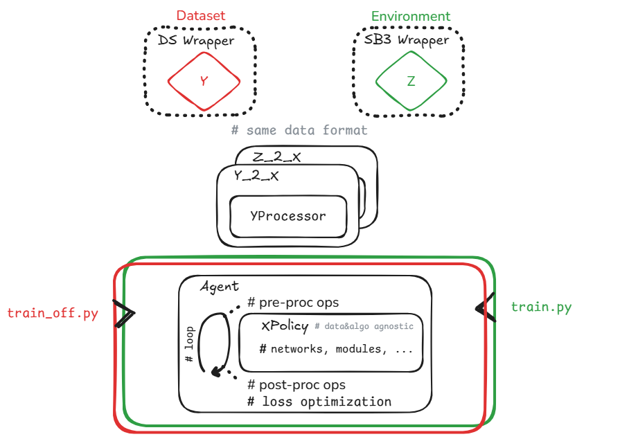

# Stable Baselines3 DevKit

A flexible, modular framework based on Stable Baselines3 for training reinforcement learning (RL) and imitation learning (IL) agents across diverse robotic simulation environments and demonstration datasets.

## Overview

This framework provides a unified interface for training policies using either simulation environments or demonstration datasets. The architecture ensures complete independence between data sources (environments vs datasets) and policy implementations, allowing seamless switching between training paradigms while maintaining consistent data processing pipelines.

## Who Is This For?

**Researchers** working on:
- Robot learning algorithms
- Multi-task policy learning
- Sim-to-real transfer
- Comparative studies across environments/datasets

**Practitioners** needing:
- Rapid prototyping of robot policies
- Flexible experimentation with different architectures
- Unified training pipeline across multiple simulators

## Key Features

### Unified Data Interface
- **Environment-agnostic**: Works with Isaac Lab, ManiSkill, MuJoCo Playground, Aloha and other custom Gym environments
- **Dataset-agnostic**: Compatible with LeRobot datasets
- Shared data format ensures policies work seamlessly across sources

### Flexible Training Algorithms
- **Supervised Learning**: Behavior cloning from demonstrations
- **On-policy RL**: PPO, Recurrent PPO, Transformer PPO (! efficient rollout buffer implementation !)
- **Off-policy RL**: SAC, FastSAC

### Out-of-the-box Features
- Distributed training with Accelerate
- Mixed precision training (FP16/BF16)
- Gradient accumulation
- Comprehensive logging (TensorBoard, Weights & Biases)
- Automatic checkpointing and resumption
- Extensive test suite

## Source Code Architecture

The framework follows a layered architecture that separates concerns:



### Component Hierarchy

1. **Data Sources**
   - **Environments**: Isaac Lab, ManiSkill, MuJoCo Playground, Aloha (via SB3 Wrapper), or contribute implementing your own!
   - **Datasets**: LeRobot demonstrations (via DS Wrapper)
   - Both produce standardized observation/action dictionaries

2. **Preprocessors**
   - Transform source-specific data formats to policy inputs
   - Handle normalization, image processing, sequence formatting
   - Examples: `Gym_2_Mlp`, `Gym_2_Lstm`, `Gym_2_Sac`, `Aloha_2_Lstm`

3. **Agents**
   - Manage training loops (rollout collection, batch optimization)
   - Interface with policies through preprocessors
   - Handle loss computation and gradient updates
   - Examples: `PPO`, `RecurrentPPO`, `TransformerPPO`, `SAC`, `FastSAC`, `SL`

4. **Policies**
   - Neural network architectures (actor-critic or standalone)
   - Independent of data source or training algorithm
   - Examples: `MlpPolicy`, `LSTMPolicy`, `TransformerPolicy`, `SACPolicy`, `FastSACPolicy`, `TCNPolicy`

5. **Entry Points**
   - `train.py`: Online RL from simulation
   - `train_off.py`: Offline IL from demonstrations
   - `predict.py`: Policy evaluation and deployment

### Data Flow

```
Environment/Dataset → Wrapper → Preprocessor → Policy → Agent → Optimization
         ↓                         ↓             ↓        ↓
    Standardized              Normalized    Actions    Loss
       Format                   Inputs
```

## Installation

### Prerequisites
- Python 3.11+
- CUDA 11.8+ (for GPU training)

### Core Installation

```bash
# Clone repository
git clone https://github.com/johnMinelli/stable-baselines3-devkit
cd src
# Install dependencies
pip install -r requirements.txt
```

## Quick Start

### Online RL Training (Simulation)

Train a PPO agent with MLP policy on Isaac Lab:
```bash
python train.py \
  --task Isaac-Lift-Cube-Franka-v0 \
  --envsim isaaclab \
  --agent custom_ppo_mlp \
  --num_envs 4096 \
  --device cuda \
  --headless
```

Train a Recurrent PPO agent with LSTM policy:
```bash
python train.py \
  --task Isaac-Velocity-Flat-Anymal-D-v0 \
  --envsim isaaclab \
  --agent custom_ppo_lstm \
  --num_envs 2048 \
  --device cuda \
  --headless
```

### Offline IL Training (Demonstrations required e.g. [ManiSkill_StackCube-v1](https://huggingface.co/datasets/johnMinelli/ManiSkill_StackCube-v1_recovery) )

Train an LSTM policy via behavior cloning:
```bash
python train_off.py \
  --task SL \
  --agent Lerobot/StackCube/lerobot_sl_lstm_cfg \
  --device cuda \
  --n_epochs 200 \
  --batch_size 64
```

[//]: # (`python train.py --task Isaac-Lift-Cube-Franka-v0 --envsim isaaclab --headless --num_envs 2 --agent custom_ppo_mlp --device cuda --sim_device cuda`)

[//]: # (`python train.py --task Isaac-Velocity-Flat-Anymal-D-v0 --envsim isaaclab --num_envs 2 --headless --agent custom_ppo_lstm --device cuda --sim_device cuda`)

[//]: # (`python train.py --task Isaac-Velocity-Flat-Anymal-D-v0 --envsim isaaclab --num_envs 2 --headless --agent custom_ppo_tr --device cuda --sim_device cuda`)

[//]: # (`python train.py --task StackCube-v1 --envsim maniskill --num_envs 2 --agent Maniskill/stack_ppo_mlp_cfg --device cuda --sim_device cuda`)

[//]: # (`python train.py --task gym_aloha/AlohaInsertion-v0 --envsim aloha --num_envs 2 --agent Aloha/insertion_ppo_mlp_cfg --device cuda`)

[//]: # (`python train_off.py --task SL --agent Lerobot/StackCube/lerobot_sl_lstm_cfg --device cuda:0 --val_interval 10000 --n_epochs 200`)

### Policy Evaluation

Evaluate a trained policy:
```bash
python predict.py \
  --task Isaac-Velocity-Flat-Anymal-D-v0 \
  --envsim isaaclab \
  --agent custom_ppo_mlp \
  --num_envs 1 \
  --val_episodes 100 \
  --device cuda \
  --resume
  (opt) --checkpoint path/to/best_model.zip
```

[//]: # (`python predict.py --task Isaac-Velocity-Flat-Anymal-D-v0 --envsim isaaclab --num_envs 1 --val_episodes 100 --agent custom_ppo_mlp --device cuda --sim_device cuda --resume`)

[//]: # (`python predict.py --task StackCube-v1 --envsim maniskill --num_envs 1 --val_episodes 100 --agent Maniskill/maniskill_sl_inference_cfg --device cuda --sim_device cuda --resume --checkpoint /media/data01/PycharmProjects/dev/src/save/SL/2026-01-07_01-51-05/best_model.zip`)
## Usage Guide

### Creating a New Policy

Policies must inherit from `BasePolicy` and implement required methods:

```python
from stable_baselines3.common.policies import BasePolicy

class CustomPolicy(BasePolicy):
    def __init__(self, observation_space, action_space, lr_schedule, **kwargs):
        super().__init__(observation_space, action_space, ...)
        # Define networks

    def forward(self, obs):
        # Compute actions, values, log_probs
        return actions, values, log_probs

    def predict_values(self, obs):
        # Compute state values
        return values
```

Register in agent's `policy_aliases`:
```python
class PPO(OnPolicyAlgorithm):
    policy_aliases = {
        "MlpPolicy": MlpPolicy,
        "CustomPolicy": CustomPolicy,
    }
```

### Creating a Preprocessor

Preprocessors bridge data sources to policies:

```python
from common.preprocessor import Preprocessor

class CustomPreprocessor(Preprocessor):
    def preprocess(self, obs):
        # Transform observations for policy
        processed = self.normalize_observations(obs)
        # Additional transformations
        return processed

    def postprocess(self, actions):
        # Transform policy outputs for environment
        return self.unnormalize_actions(actions)
```

### Adding a New Environment

1. Create environment-specific wrapper:
```python
class NewEnvWrapper(gym.Wrapper):
    def __init__(self, env):
        super().__init__(env)
        # Setup observation/action spaces

    def reset(self):
        # Return standardized observations

    def step(self, action):
        # Return standardized obs, reward, done, info
```

2. Create preprocessor for the environment:
```python
class NewEnv_2_Policy(Preprocessor):
    # Implement preprocessing logic
```

3. Add YAML configuration file in `configs/agents/NewEnv/`

4. Update `train.py` imports:
```python
if args_cli.envsim == "newenv":
    import newenv_package
```

[//]: # ()
[//]: # (## Testing)

[//]: # ()
[//]: # (The framework includes a comprehensive test suite covering unit, integration, and end-to-end scenarios.)

[//]: # ()
[//]: # (### Quick Validation)

[//]: # (```bash)

[//]: # (# Fast smoke tests &#40;~10 seconds&#41;)

[//]: # (pytest tests/test_smoke.py -v)

[//]: # (```)

[//]: # ()
[//]: # (### Component Tests)

[//]: # (```bash)

[//]: # (# Unit tests &#40;~2 minutes&#41;)

[//]: # (pytest tests/unit/ -v)

[//]: # ()
[//]: # (# Integration tests &#40;~5 minutes&#41;)

[//]: # (pytest tests/integration/ -v)

[//]: # (```)

[//]: # ()
[//]: # (### Full Test Suite)

[//]: # (```bash)

[//]: # (# All tests including E2E &#40;~15-30 minutes, requires environments&#41;)

[//]: # (pytest -v)

[//]: # ()
[//]: # (# With coverage report)

[//]: # (pytest --cov=algos --cov=common --cov-report=html)

[//]: # (```)

[//]: # ()
[//]: # (### Testing Real Training Scripts)

[//]: # (```bash)

[//]: # (# Test actual train.py execution)

[//]: # (pytest tests/integration/test_training_scripts.py -v)

[//]: # ()
[//]: # (# Specific environment)

[//]: # (pytest tests/integration/test_training_scripts.py::TestTrainScriptIntegration::test_ppo_mlp_isaac_quick_training -v)

[//]: # (```)

[//]: # ()
[//]: # (See `tests/README.md` and `tests/TESTING_STRATEGY.md` for detailed testing documentation.)

## Contributing

Yes, You can! :)

[//]: # (Here's how to get started:)

[//]: # ()
[//]: # (### Development Setup)

[//]: # ()
[//]: # (1. Fork and clone the repository)

[//]: # (2. Install development dependencies:)

[//]: # (```bash)

[//]: # (pip install -r requirements.txt)

[//]: # (pip install pytest pytest-cov flake8 black)

[//]: # (```)

[//]: # ()
[//]: # (3. Install pre-commit hooks:)

[//]: # (```bash)

[//]: # (pre-commit install)

[//]: # (```)

[//]: # ()
[//]: # (### Contribution Workflow)

[//]: # ()
[//]: # (1. **Create a feature branch:**)

[//]: # (```bash)

[//]: # (git checkout -b feature/your-feature-name)

[//]: # (```)

[//]: # ()
[//]: # (2. **Make your changes** following the code style:)

[//]: # (   - Use Black for formatting)

[//]: # (   - Follow PEP 8 conventions)

[//]: # (   - Add type hints where applicable)

[//]: # (   - Document public APIs)

[//]: # ()
[//]: # (3. **Write tests:**)

[//]: # (   - Add unit tests for new components in `tests/unit/`)

[//]: # (   - Add integration tests if modifying agent-policy interactions)

[//]: # (   - Ensure all tests pass:)

[//]: # (   ```bash)

[//]: # (   pytest tests/test_smoke.py tests/unit/ -v)

[//]: # (   ```)

[//]: # ()
[//]: # (4. **Update documentation:**)

[//]: # (   - Add docstrings to new functions/classes)

[//]: # (   - Update README if adding features)

[//]: # (   - Add examples to demonstrate usage)

[//]: # ()
[//]: # (5. **Run code quality checks:**)

[//]: # (```bash)

[//]: # (# Format code)

[//]: # (black algos/ common/ tests/)

[//]: # ()
[//]: # (# Lint)

[//]: # (flake8 algos/ common/ tests/)

[//]: # ()
[//]: # (# Type check &#40;optional&#41;)

[//]: # (mypy algos/ common/)

[//]: # (```)

[//]: # ()
[//]: # (6. **Commit and push:**)

[//]: # (```bash)

[//]: # (git add .)

[//]: # (git commit -m "feat: add your feature description")

[//]: # (git push origin feature/your-feature-name)

[//]: # (```)

[//]: # ()
[//]: # (7. **Create a Pull Request:**)

[//]: # (   - Provide clear description of changes)

[//]: # (   - Link related issues)

[//]: # (   - Ensure CI passes)

[//]: # ()
[//]: # (### What to Contribute)

[//]: # ()
[//]: # (**High-priority areas:**)

[//]: # (- New policy architectures &#40;Diffusion, VQ-VAE, etc.&#41;)

[//]: # (- Additional environment wrappers)

[//]: # (- Off-policy RL algorithms &#40;SAC, TD3&#41;)

[//]: # (- Performance optimizations)

[//]: # (- Documentation improvements)

[//]: # (- Bug fixes)

[//]: # ()
[//]: # (**Guidelines:**)

[//]: # (- Keep changes focused and atomic)

[//]: # (- Maintain backward compatibility)

[//]: # (- Follow existing patterns and conventions)

[//]: # (- Add tests for new functionality)

[//]: # (- Update documentation)

[//]: # ()
[//]: # (### Reporting Issues)

[//]: # ()
[//]: # (When reporting bugs, please include:)

[//]: # (- Python version and OS)

[//]: # (- Package versions &#40;`pip freeze`&#41;)

[//]: # (- Minimal code to reproduce)

[//]: # (- Error messages and stack traces)

[//]: # (- Expected vs actual behavior)

[//]: # ()
[//]: # (### Code of Conduct)

[//]: # ()
[//]: # (- Be respectful and constructive)

[//]: # (- Welcome newcomers)

[//]: # (- Focus on technical merits)

[//]: # (- Assume good intentions)

## Citation

If you use this framework in your research, please cite:

```bibtex
@misc{stable-baselines3-devkit,
  title = {Stable Baselines3 DevKit},
  author = {Giovanni Minelli},
  year = {2026},
  url = {https://github.com/johnMinelli/stable-baselines3-devkit}
}
```
## Acknowledgments

This framework builds upon:
- [Stable Baselines3](https://github.com/DLR-RM/stable-baselines3)
- [Stable Baselines3 Contrib](https://github.com/Stable-Baselines-Team/stable-baselines3-contrib)
- [Imitation](https://github.com/HumanCompatibleAI/imitation)